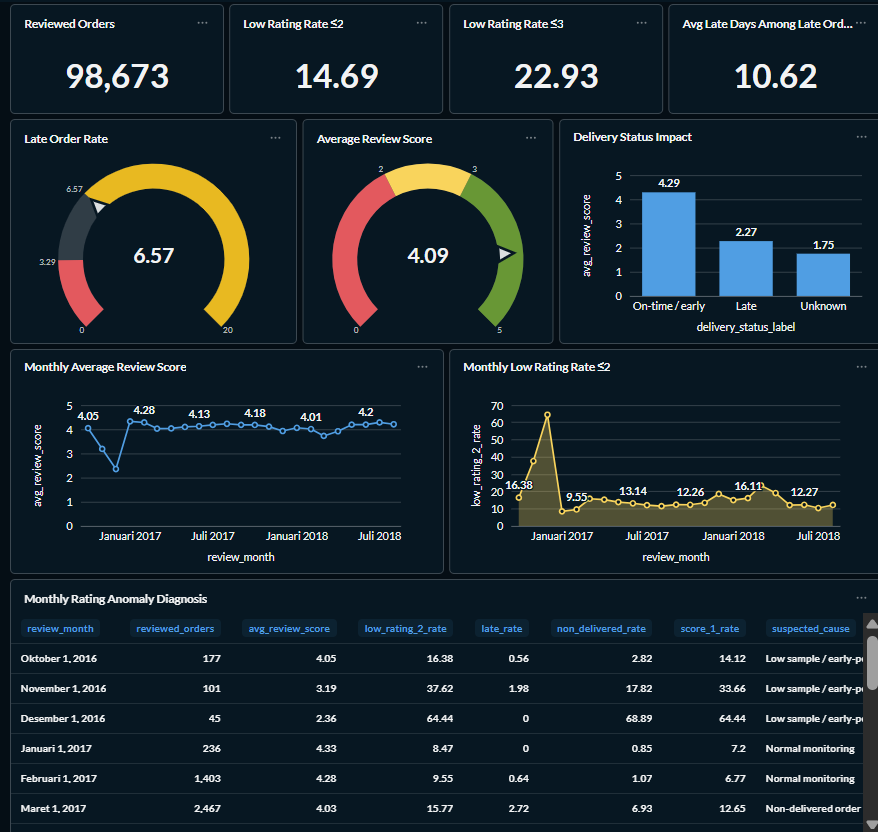
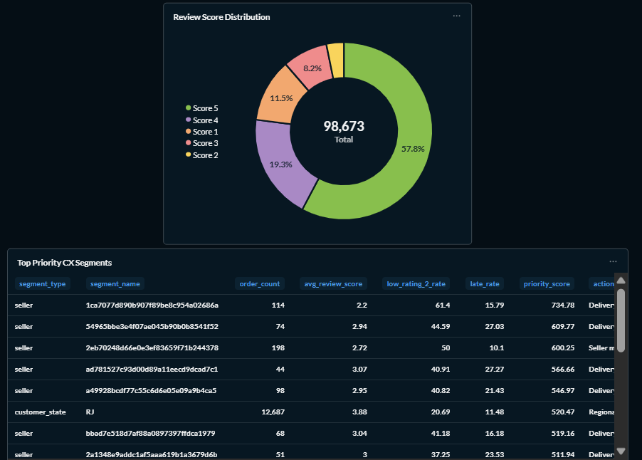
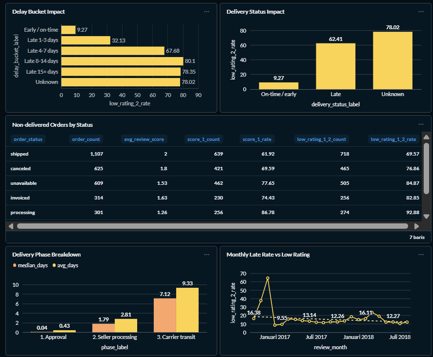
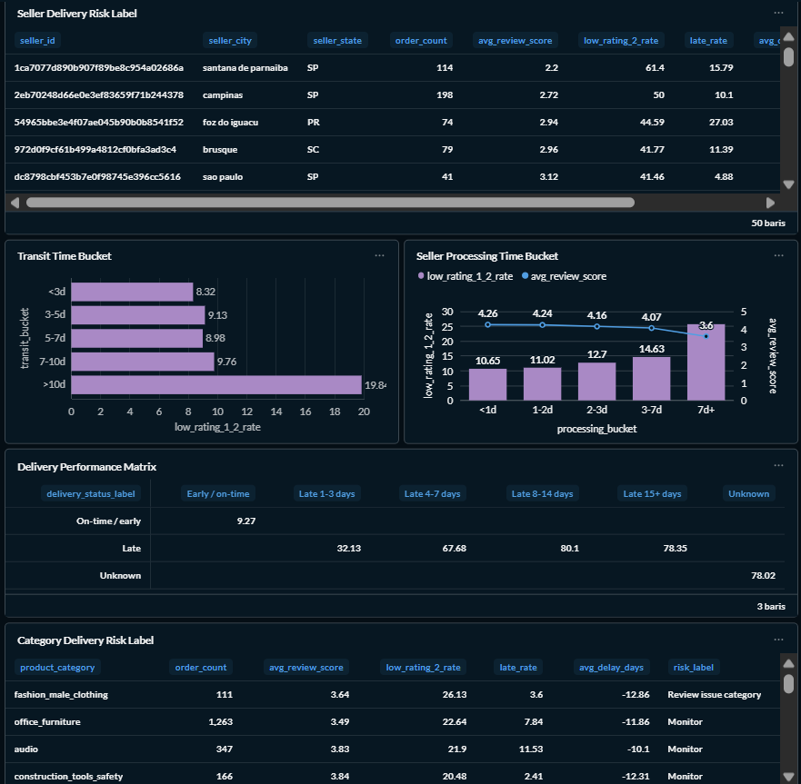
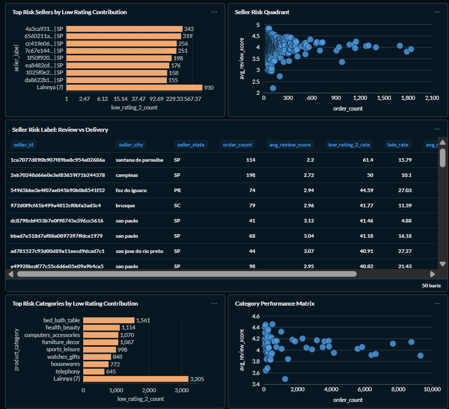
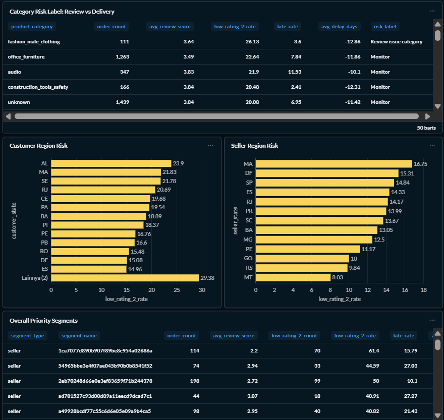
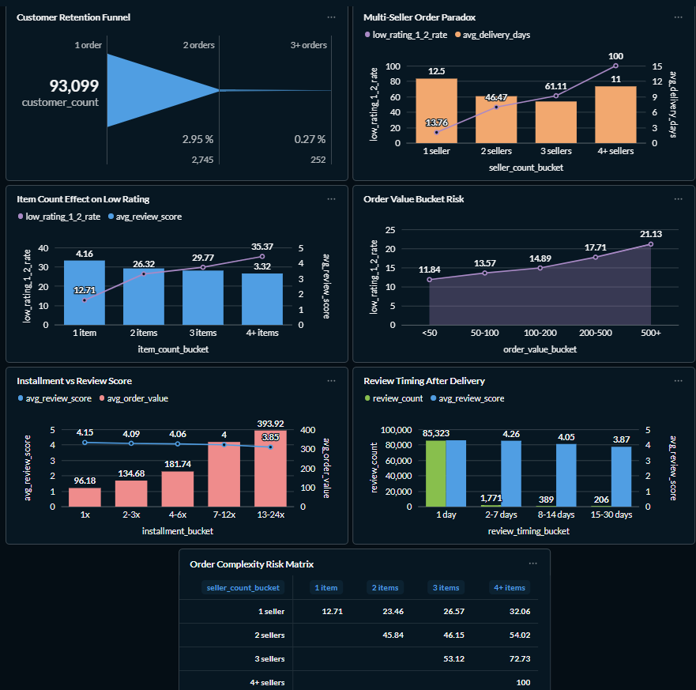
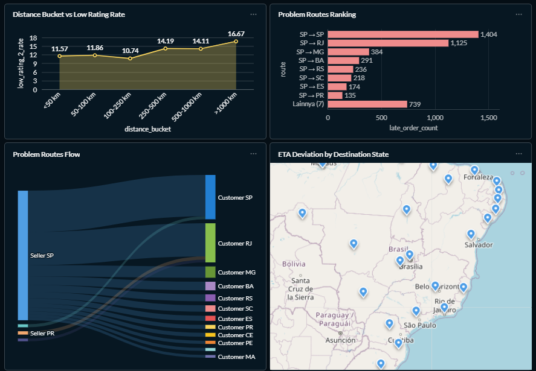
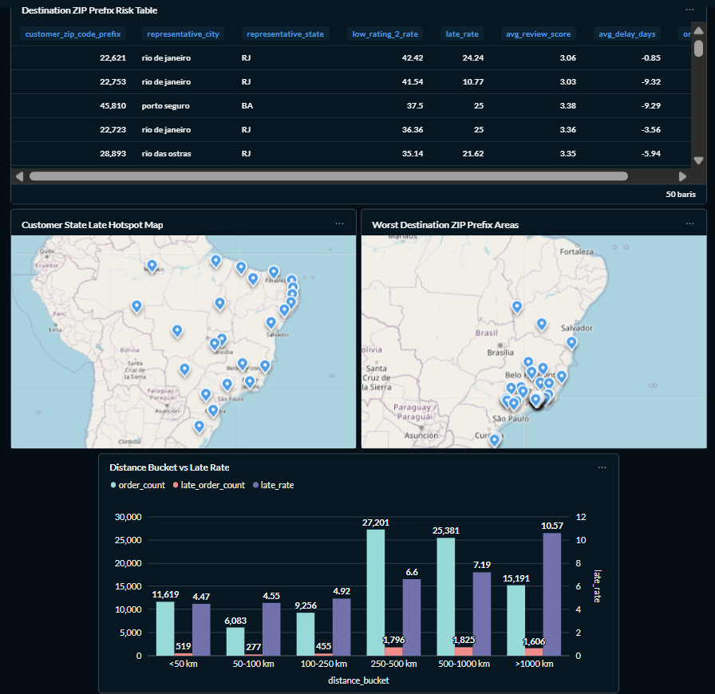

# FP MCI 2026 - Customer Experience Root Cause Analysis

**Nama:** Muhammad Farhan
**NRP:** 5054241018

Final Project ini membangun pipeline analitik end-to-end untuk membantu **Customer Experience Analyst** menjawab pertanyaan bisnis utama: **mengapa low rating terjadi dan mengapa review score sulit meningkat secara konsisten**.

Project ini tidak hanya memantau metrik review secara agregat. Fokus utamanya adalah menghubungkan review score dengan konteks transaksi, delivery, seller, kategori produk, wilayah, perilaku order, serta sinyal tambahan dari NLP dan ML. Hasil analisis dipakai untuk menyusun kandidat root cause yang dapat ditelusuri dari data mentah sampai dashboard Metabase.

Prioritas scope project:

1. Airflow DAG sebagai orchestration layer.
2. ClickHouse sebagai analytical warehouse.
3. Metabase dashboard sebagai business-facing analysis layer.
4. NLP dan ML sebagai explorasi tambahan.

## Business Problem and Persona

**Selected persona:** Customer Experience Analyst

Situasi bisnis yang dianalisis:

- CEO ingin memahami mengapa review score perusahaan belakangan sulit meningkat dan tampak stagnan.
- Tim internal belum memiliki penjelasan berbasis data tentang faktor yang paling berasosiasi dengan pengalaman pelanggan.
- Ada beberapa asumsi yang saling bersaing: kualitas produk, pengalaman delivery, performa seller, serta perbedaan regional/customer.
- Project ini dibuat untuk berpindah dari monitoring review agregat menuju **root-cause analysis** di sepanjang transaction journey.

Dengan framing tersebut, dashboard dan pipeline tidak diposisikan sebagai laporan deskriptif biasa. Setiap tab dashboard diarahkan untuk menjawab "mengapa low rating terjadi" melalui segmentasi, drilldown, dan indikator risiko yang dapat ditindaklanjuti.

Catatan metodologis: hasil analisis bersifat asosiatif. README dan dashboard menggunakan istilah seperti **indikasi**, **berasosiasi**, dan **kandidat root cause**, bukan klaim kausal absolut.

## Project Objectives

- Membangun pipeline CSV to ClickHouse yang dapat dijalankan ulang melalui Airflow.
- Membentuk mart analitik untuk order-level, item-level, monthly review, delivery performance, dan helper geolocation.
- Menyediakan dashboard Metabase untuk membaca pola review score, low rating rate, delivery delay, seller/category/region risk, customer behavior, dan spatial risk.
- Menyediakan evidence log berupa SQL analytics output di Markdown dan CSV untuk paper serta presentasi.
- Menambahkan NLP review mining untuk memahami bahasa keluhan pelanggan dari teks ulasan Portugis Brazil.
- Menambahkan ML low-rating risk simulator sebagai alat pendukung simulasi risiko, bukan sistem prediksi operasional utama.

## End-to-End Architecture

Alur utama project:

```text
Raw CSV dataset
-> Airflow DAG validation and orchestration
-> Python CSV loader
-> ClickHouse staging tables
-> ClickHouse mart tables and geolocation helper view
-> SQL analytics queries
-> Metabase dashboard
-> Query findings export for analysis

```

Peran setiap layer:

| Layer                | Komponen                                                         | Fungsi                                                                           |
| -------------------- | ---------------------------------------------------------------- | -------------------------------------------------------------------------------- |
| Raw data             | `data/raw/*.csv`                                               | Dataset transaksi, review, customer, seller, product, payment, dan geolocation.  |
| Orchestration        | Airflow DAG                                                      | Validasi input, pembuatan schema, load CSV, build mart, dan validasi output.     |
| Analytical warehouse | ClickHouse                                                       | Menyimpan staging table, mart table, helper view, dan menjalankan analytics SQL. |
| Analytics logic      | `sql/analytics/*.sql`                                          | Query untuk KPI, drilldown dashboard, dan evidence paper.                        |
| BI layer             | Metabase                                                         | Dashboard business-facing untuk Customer Experience Analyst.                     |
| Evidence layer       | `docs/query_outputs/`, `docs/12_dashboard_query_findings.md` | Hasil query untuk dianalisis.                                                    |
| Extensions           | NLP notebook, ML model artifacts                                 | Analisis teks review dan risk simulation.                                        |

## Repository Structure

```text
farhan_fp_mci_customer_experience/
|-- dags/
|   `-- dag_customer_experience_pipeline.py
|-- dashboard/
|   |-- README.md
|   |-- metabase_notes.md
|   `-- screnshoot/
|-- data/
|   |-- raw/
|   `-- processed/
|       `-- nlp/
|-- docs/
|   |-- assets/
|   |   |-- dashbord/
|   |   |-- ml/
|   |   `-- nlp/
|   |-- query_outputs/
|   |-- 08_business_analysis_summary.md
|   |-- 12_dashboard_query_findings.md
|   `-- 13_repository_architecture_guide.md
|-- models/
|   |-- calibrated_lgbm_low_rating.pkl
|   |-- feature_schema.json
|   |-- preprocessor.pkl
|   |-- sample_inputs.json
|   `-- predict_risk.py
|-- notebooks/
|   |-- 01_data_understanding.ipynb
|   |-- 02_eda_customer_experience.ipynb
|   |-- FP_MCI_ML_Rating_Risk_V2.ipynb
|   `-- NLP_Review_Analysis.ipynb
|-- scripts/
|   |-- export_dashboard_findings.py
|   `-- load_csv_to_clickhouse.py
|-- sql/
|   |-- ddl/
|   |-- etl/
|   `-- analytics/
|-- docker-compose.yml
|-- Dockerfile.airflow
|-- requirements.txt
|-- .env.example
`-- README.md
```

Catatan asset: folder screenshot dashboard pada repository saat ini bernama `docs/assets/dashbord/`. README menggunakan path aktual tersebut agar gambar dapat tampil di GitHub.

## Tech Stack

| Area                   | Technology                                    |
| ---------------------- | --------------------------------------------- |
| Orchestration          | Apache Airflow                                |
| Analytical database    | ClickHouse                                    |
| BI dashboard           | Metabase                                      |
| Metadata database      | PostgreSQL for Airflow                        |
| Runtime                | Docker Compose                                |
| Data loading           | Python, pandas, clickhouse-connect            |
| SQL layer              | ClickHouse SQL                                |
| NLP extension          | NLTK, TF-IDF, BERTopic, sentence-transformers |
| ML extension           | scikit-learn, LightGBM                        |
| Documentation evidence | Markdown, CSV query exports                   |

Local service ports:

| Service         | Local URL                 |
| --------------- | ------------------------- |
| Airflow         | `http://localhost:8085` |
| ClickHouse HTTP | `http://localhost:8123` |
| Metabase        | `http://localhost:3002` |

## Pipeline Execution Overview

Airflow DAG utama berada di:

```text
dags/dag_customer_experience_pipeline.py
```

Nama DAG:

```text
dag_customer_experience_pipeline
```

Urutan task DAG:

1. `validate_raw_files`
2. `create_clickhouse_database`
3. `create_staging_tables`
4. `load_csv_to_staging`
5. `build_geo_zip_prefix_reference`
6. `create_mart_tables`
7. `build_customer_experience_orders`
8. `build_customer_experience_items`
9. `build_monthly_review_trend`
10. `build_delivery_performance`
11. `validate_pipeline_outputs`

Pipeline membutuhkan raw CSV berikut:

```text
orders.csv
order_reviews.csv
order_items.csv
customers.csv
sellers.csv
products.csv
category_translation.csv
order_payments.csv
geolocation.csv
```

Output ClickHouse utama:

| Table/View                          | Grain                          | Fungsi                                                        |
| ----------------------------------- | ------------------------------ | ------------------------------------------------------------- |
| `stg_orders`                      | Raw order                      | Staging order dan timestamp fulfillment.                      |
| `stg_order_reviews`               | Raw review                     | Staging review score dan review comment.                      |
| `stg_order_items`                 | Raw order item                 | Staging seller, item, price, dan freight.                     |
| `stg_customers`                   | Raw customer                   | Staging customer city/state/zip prefix.                       |
| `stg_sellers`                     | Raw seller                     | Staging seller city/state/zip prefix.                         |
| `stg_products`                    | Raw product                    | Staging product dan kategori.                                 |
| `stg_order_payments`              | Raw payment                    | Staging payment type, installment, dan value.                 |
| `stg_geolocation`                 | Raw zip geolocation            | Staging latitude/longitude per zip prefix.                    |
| `geo_zip_prefix_reference`        | One row per zip prefix         | Helper view untuk join geolocation tanpa duplikasi order.     |
| `mart_customer_experience_orders` | One row per order              | Mart utama review, delivery, customer, dan payment context.   |
| `mart_customer_experience_items`  | One row per order item         | Mart seller/category/item untuk segment risk.                 |
| `mart_monthly_review`             | One row per review month       | Mart trend review bulanan.                                    |
| `mart_delivery_performance`       | Delivery status + delay bucket | Mart untuk delivery impact analysis berbasis reviewed orders. |

## Proof of Successful DAG Execution

Validasi pipeline dilakukan pada task `validate_pipeline_outputs`. Beberapa check yang dijalankan:

- staging dan mart table tidak kosong;
- `review_score = 0` tidak muncul pada mart order-level;
- order tanpa review tetap dipertahankan sebagai `NULL`, bukan dianggap low rating;
- monthly mart tidak memiliki default date `1970-01-01`;
- jumlah reviewed orders pada monthly mart divalidasi terhadap target data.

Screenshot Airflow belum disertakan karena asset manual belum tersedia. Setelah DAG sukses dijalankan, tambahkan screenshot ke bagian ini tanpa mengubah struktur README.

## Metabase Dashboard Overview

Dashboard Metabase bernama **Customer Experience Root Cause Dashboard**. Dashboard ini dirancang bukan sebagai laporan angka biasa, melainkan sebagai alat analisis yang memandu Customer Experience Analyst menjawab satu pertanyaan besar secara bertahap: *mengapa review score sulit naik, dan di mana harus mulai bertindak?*

Setiap tab memiliki peran yang berbeda dalam narasi analisis, dari gambaran besar di tingkat CEO hingga detail operasional yang bisa langsung ditindaklanjuti oleh tim CX.

> Angka pada bagian ini divalidasi dari `docs/query_outputs/` dan `docs/12_dashboard_query_findings.md`. Screenshot digunakan sebagai referensi tampilan dan alur interpretasi, bukan sebagai sumber angka utama.

---

### Tab 1 - Executive Overview

**Pertanyaan utama:** Apakah review score benar-benar stagnan? Seberapa besar masalahnya?

Tab ini adalah pintu masuk. Sebelum melihat detail apapun, seorang CEO atau kepala tim perlu tahu dulu: apakah ada masalah nyata di sini, atau hanya persepsi? Tab ini menjawabnya langsung.

**Gambar 1 - KPI Utama, Tren Review Bulanan, dan Anomaly Diagnosis**



Empat angka utama di bagian atas memperlihtkan  **98.673** order yang direview, **14.69%** berakhir dengan rating 1 atau 2, rata-rata skor keseluruhan adalah **4.09**, dan ketika ada keterlambatan, rata-rata telat mencapai **10.62 hari** - lebih dari seminggu. Late order rate platform berada di **6.57%**.

Di sebelah kanan KPI ada konfirmasi penting: bar chart Delivery Status Impact memperlihatkan bahwa order yang tiba tepat waktu mendapat rata-rata skor **4.29**, sementara order yang terlambat jatuh ke **2.27**, dan order dengan status tidak jelas (*unknown*) bahkan hanya **1.75**. Ini bukan korelasi lemah melainkan kontras yang sangat tajam.

Dua grafik tren di tengah memperlihatkan pergerakan bulanan dari awal 2017 hingga pertengahan 2018. Rata-rata skor tidak pernah benar-benar naik secara konsisten selama 19 bulan pengamatan  bergerak naik-turun di kisaran 3.7–4.3 tanpa tren yang jelas ke atas. Sementara itu, low rating rate pernah mencapai puncak **64.44%** pada Desember 2016 (dengan catatan volume saat itu masih sangat kecil), lalu menstabilkan di kisaran 9–16% pada periode operasional normal.

Di bawahnya, tabel Monthly Rating Anomaly Diagnosis merekam setiap bulan berikut dugaan penyebabnya. Bulan-bulan awal 2016 diberi label *low sample / early-period*, sementara periode setelahnya menunjukkan penyebab yang lebih spesifik. Tabel ini berguna sebagai catatan historis ketika tim ingin menelusuri mengapa skor bulan tertentu bermasalah.

**Gambar 2 — Distribusi Review Score dan Top Priority CX Segments**



Donut chart distribusi review score menceritakan sesuatu yang tidak terlihat dari rata-rata 4.09 saja. **57.8%** pelanggan memberikan rating 5 dan **11.5%** memberikan rating 1, menjadikannya kelompok terbesar *kedua* setelah rating 5. Rating 2, 3, dan 4 mengisi sisanya, dengan rating 4 di **19.3%** dan rating 3 hanya **8.2%**. Polanya sangat jelas: pelanggan cenderung ke ujung-ujungnya. Hampir tidak ada yang merasa "biasa-biasa saja" dengan pengalaman mereka.

Konsekuensi operasional dari pola ini cukup serius: tidak ada buffer tengah. Setiap gangguan kecil dalam proses pengiriman atau fulfillment langsung menghasilkan rating 1, bukan rating 3. Platform ini tidak memberikan second chance kepada dirinya sendiri.

Di bawah donut chart, tabel **Top Priority CX Segments** menggabungkan berbagai dimensi risiko seller, dan customer state ke dalam satu daftar yang sudah diprioritaskan berdasarkan *priority score* yang mempertimbangkan volume dan tingkat rating buruk sekaligus. State RJ misalnya muncul dengan 12.687 order dan low_rating_2_rate **20.69%**, bersanding dengan seller-seller individual yang meskipun volumenya lebih kecil, tingkat rating buruknya mencapai 40–61%. Tabel ini dirancang agar tim CX bisa langsung tahu *siapa* yang harus ditangani lebih dulu tanpa perlu menghitung ulang.

**Cara membaca tab ini:** Mulai setiap sesi analisis dari sini untuk memastikan semua pihak berbicara dari angka yang sama. Setelah itu, lanjut ke tab Delivery Fulfillment untuk mencari *mengapa*, tab Segment Risk untuk mencari *siapa*, tab Customer Order Behavior untuk memahami *pola*, dan tab Geolocation untuk melihat *di mana*.

*Sources: `docs/query_outputs/kpi_summary.csv`, `docs/query_outputs/review_score_distribution.csv`, `docs/query_outputs/monthly_review_trend.csv`, `docs/query_outputs/monthly_rating_anomaly_diagnosis.csv`, `docs/query_outputs/priority_cx_segments.csv`.*

---

### Tab 2 - Delivery Fulfillment

**Pertanyaan utama:** Apakah keterlambatan pengiriman benar-benar penyebab utama rating buruk? Dan bagian mana dari proses pengiriman yang paling bermasalah?

Kalau Tab 1 memperlihatkan *bahwa* ada masalah, Tab 2 mulai menjelaskan *mengapa*. Pengiriman adalah tersangka utama  dan tab ini membuktikannya dengan angka dari beberapa sudut sekaligus.

**Gambar 1 - Delay Bucket Impact, Delivery Status, Non-Delivered Orders, dan Delivery Phase Breakdown**



Dua chart di bagian atas memperlihatkan kontras yang sulit diabaikan. Bar chart *Delay Bucket Impact* menunjukkan eskalasi yang sangat tajam: order yang tiba tepat waktu atau lebih awal hanya menghasilkan **9.27%** rating buruk. Begitu telat 1–3 hari, angkanya loncat ke **32.13%**. Telat 4–7 hari: **67.68%**. Telat 8–14 hari: **80.1%**. Bar chart *Delivery Status Impact* di sebelahnya menegaskan hal yang sama dari sudut berbeda  late orders rata-rata hanya mendapat skor **2.27**, dan order dengan status *unknown* bahkan hanya **1.75** dari skala 5.

**Hari ke-4 adalah titik tidak bisa kembali.** Sebelum hari ke-4, ada kemungkinan pelanggan masih toleran. Setelah hari ke-4, hampir tidak ada cara untuk menyelamatkan pengalaman mereka. Ini bukan angka teoritis  ini bisa langsung jadi SLA threshold untuk sistem alarm: jika order sudah 3 hari melewati estimasi, masih ada kemungkinan untuk intervensi. Setelah hari ke-4, peluang itu hampir hilang.

Tabel *Non-Delivered Orders by Status* di tengah memperlihatkan 7 kategori order yang tidak sampai ke tangan pelanggan. Kelompok yang paling mengkhawatirkan adalah *processing* dengan rata-rata skor **1.26** dan *unavailable* dengan rata-rata **1.53,** hampir tidak ada pelanggan di kelompok ini yang puas. Order berstatus *shipped* (sudah dikirim tapi belum tiba) berjumlah 1.107 dengan rata-rata skor **2.0**. Secara total, ini adalah kelompok yang hampir pasti hilang sebagai pelanggan.

Di bagian bawah, *Delivery Phase Breakdown* memecah proses pengiriman ke tiga fase: Approval rata-rata **0.43 hari** (sangat cepat, bukan sumber masalah), Seller Processing rata-rata **2.81 hari** (median 1.79 hari), dan Carrier Transit rata-rata **9.33 hari** (median 7.12 hari). Grafik tren di sebelahnya memperlihatkan bagaimana late rate dan low rating rate bergerak beriringan dari bulan ke bulan  konfirmasi visual bahwa keduanya terhubung erat.

**Gambar 2 - Seller Delivery Risk, Transit Time, Seller Processing Time, dan Delivery Performance Matrix**



Tabel *Seller Delivery Risk Label* di bagian atas mendaftar 50 seller dengan metrik lengkap: order count, rata-rata review score, low_rating_2_rate, dan late rate. Ini adalah daftar referensi yang bisa langsung digunakan oleh tim seller management untuk menentukan seller mana yang perlu dipanggil lebih dulu.

Dua chart di tengah memisahkan dua jenis masalah yang sering digabungkan dalam satu label "pengiriman lambat". Chart *Transit Time Bucket* sebelah kanan memperlihatkan bahwa transit di atas 10 hari menghasilkan **19.84%** low rating  hampir dua kali lipat dibanding transit kurang dari 3 hari (8.32%). Chart *Seller Processing Time Bucket* menunjukkan eskalasi serupa: seller yang memproses dalam sehari hanya menghasilkan **10.65%** rating buruk, sementara seller yang butuh 7 hari atau lebih mencapai **25.7%** (dengan rata-rata skor yang turun ke 3.6).

Dua driver ini perlu ditangani secara terpisah. Masalah seller processing adalah masalah fulfillment di sisi seller, solusinya ada di coaching program, SLA seller, atau sistem flagging otomatis. Masalah transit carrier adalah masalah logistik carrier, solusinya ada di negosiasi SLA rute, diversifikasi kurir, atau adjustment estimasi pengiriman. Menggabungkan keduanya dalam satu laporan "delivery late" hanya membuat prioritas intervensi menjadi tidak tepat sasaran.

*Delivery Performance Matrix* di bawah merangkum semua ini dalam satu tabel silang yang mudah dibaca.

**Apa yang bisa dilakukan:** Pasang empat alarm operasional order yang sudah 3 hari melewati estimasi, status pengiriman *unknown* yang bertahan lebih dari 7 hari, seller dengan waktu proses rata-rata di atas 7 hari dalam 30 hari terakhir, dan jalur kurir dengan transit rata-rata di atas 10 hari.

*Sources: `docs/query_outputs/delivery_status_impact.csv`, `docs/query_outputs/delay_bucket_impact.csv`, `docs/query_outputs/non_delivered_orders_by_status.csv`, `docs/query_outputs/delivery_phase_breakdown.csv`, `docs/query_outputs/transit_time_bucket.csv`, `docs/query_outputs/seller_processing_time_bucket.csv`, `docs/query_outputs/seller_delivery_risk_label.csv`, `docs/query_outputs/category_delivery_risk_label.csv`.*

---

### Tab 3 - Segment Risk

**Pertanyaan utama:** Rating buruk itu datang dari mana??? apakah dari seller tertentu, kategori produk tertentu, atau wilayah tertentu?

Tab ini menjawab pertanyaan *siapa dan apa* yang paling banyak menyumbang rating buruk. Keterlambatan pengiriman adalah mekanismenya, tapi tidak semua seller, kategori, dan wilayah berkontribusi secara merata. Di sinilah kita bisa memprioritaskan.

**Gambar 1 - Top Risk Sellers, Seller Risk Quadrant, Seller Risk Table, dan Category Risk**



Bar chart *Top Risk Sellers by Low Rating Contribution* menampilkan seller berdasarkan jumlah absolut order bermasalah yang mereka hasilkan  bukan hanya persentasenya. Seller teratas menghasilkan **342** low-rating orders, diikuti seller lain di angka 319, 256, dan seterusnya. Pendekatan berbasis volume ini penting: sebuah seller dengan 60% rating buruk tapi hanya 10 order berdampak jauh lebih kecil ke platform dibanding seller dengan 30% rating buruk tapi 300 order.

*Seller Risk Quadrant* di sebelahnya memvisualisasikan seluruh populasi seller dalam satu scatter plot  sumbu horizontal adalah volume order, sumbu vertikal adalah rata-rata review score. Dari pola yang terbentuk, sebagian besar seller berkumpul di area volume rendah dengan skor yang bervariasi. Yang perlu diperhatikan adalah seller yang muncul di kanan bawah: volume tinggi sekaligus skor rendah kombinasi yang paling merusak karena menjangkau banyak pelanggan.

Tabel *Seller Risk Label: Review vs Delivery* di bawahnya mendaftar 50 seller dengan metrik lengkap, sehingga tim bisa langsung membaca seller mana yang masalahnya lebih ke review (kualitas produk/layanan) dan mana yang lebih ke delivery (keterlambatan pengiriman).

Di bagian bawah, bar chart *Top Risk Categories* memperlihatkan kategori dengan jumlah low-rating orders terbanyak: **bed_bath_table** memimpin dengan 1.561, diikuti health_beauty (1.114), computers_accessories (1.070), furniture_decor (1.067), dan sports_leisure (998). *Category Performance Matrix* di sebelahnya memperlihatkan posisi tiap kategori dalam scatter plot skor vs volume, membantu mengidentifikasi kategori mana yang sebenarnya bisa lebih baik jika ada intervensi.

**Gambar 2 - Category Risk Table, Customer Region Risk, Seller Region Risk, dan Priority Segments**



Tabel *Category Risk Label: Review vs Delivery* di bagian atas memberikan konteks tambahan per kategori, apakah masalah utamanya di sisi review (kualitas, ekspektasi produk) atau di sisi delivery (keterlambatan). Kategori *fashion_male_clothing* misalnya diberi label "Review issue category" meskipun late rate-nya hanya 3.6%, menunjukkan bahwa keluhannya lebih ke produk daripada pengiriman.

Dua bar chart di tengah menunjukkan distribusi low_rating_2_rate per wilayah. Dari sisi customer, **AL (Alagoas)** tercatat paling tinggi di **23.9%**, diikuti MA (21.83%) dan SE (21.78%). **RJ (Rio de Janeiro)** berada di **20.69%** dengan volume 12.687 order — menjadikannya prioritas tertinggi karena kombinasi antara rate tinggi dan volume yang signifikan. Dari sisi seller, **MA** memimpin di 16.75%, diikuti DF (15.31%) dan SP (14.84%). Meski SP "hanya" 14.84%, volumenya yang sangat dominan berarti jumlah absolut low-rating dari seller SP jauh melampaui state manapun.

Tabel *Overall Priority Segments* di bawah menggabungkan semua dimensi  seller, customer state  ke dalam satu daftar berurutan berdasarkan prioritas. Ini adalah output yang paling langsung bisa digunakan sebagai agenda meeting CX mingguan.

**Apa yang bisa dilakukan:** Buat seller watchlist berbasis low_rating_2_count (bukan hanya rate). Prioritaskan audit CX untuk kategori bed_bath_table, computers_accessories, furniture_decor, health_beauty, dan sports_leisure. Koordinasikan penanganan khusus untuk jalur pengiriman menuju RJ. Jadikan tabel Overall Priority Segments sebagai agenda tetap dalam weekly CX review meeting.

*Sources: `docs/query_outputs/top_risk_categories.csv`, `docs/query_outputs/top_risk_sellers.csv`, `docs/query_outputs/customer_region_risk.csv`, `docs/query_outputs/seller_region_risk.csv`, `docs/query_outputs/priority_cx_segments.csv`, `docs/query_outputs/seller_risk_quadrant.csv`, `docs/query_outputs/category_performance_matrix.csv`.*

---

### Tab 4 - Customer Order Behavior

**Pertanyaan utama:** Apakah ada karakteristik order tertentu yang membuat pelanggan lebih rentan kecewa, bahkan ketika pengirimannya tepat waktu?

Tab ini melihat sesuatu yang sering terlewat: bukan masalah di pengiriman atau seller, tapi masalah di *struktur order* itu sendiri. Beberapa jenis order pada dasarnya lebih rentan menghasilkan pengalaman buruk dan pola ini terlihat bahkan setelah delivery berjalan lancar.

**Gambar 1 - Retention Funnel, Multi-Seller Paradox, Item Count, Order Value, Installment, Review Timing, dan Complexity Matrix**



Mulai dari *Customer Retention Funnel* di kiri atas: dari **93.099** pelanggan, hanya **2.95%** (2.745 orang) yang pernah kembali untuk order kedua, dan hanya **0.27%** (252 orang) yang mencapai 3 order atau lebih. Artinya **96.9% pelanggan hanya pernah belanja sekali**. Dalam kondisi ini, setiap order adalah kesan pertama sekaligus terakhir  tidak ada kesempatan kedua untuk memperbaiki pengalaman yang buruk.

Chart *Multi-Seller Order Paradox* di sebelah kanan adalah salah satu temuan paling mengejutkan di seluruh dashboard. Order dengan 1 seller menghasilkan **13.76%** rating buruk. Dengan 2 seller: **46.47%**. Dengan 3 seller: **61.11%**. Dengan 4+ seller: **100%** (meski dengan catatan sample size kecil). Yang membuatnya disebut "paradox": rata-rata hari pengiriman untuk order multi-seller justru *lebih cepat atau setara*  12.5 hari untuk 1 seller, turun ke 10 hari untuk 2 seller. Pengirimannya tidak lebih lambat, tapi rating-nya jauh lebih buruk.

Penjelasannya bukan di logistik, ini masalah *pengalaman fragmentasi*. Pelanggan yang menunggu satu paket sudah tiba sementara paket lain dari seller berbeda masih dalam perjalanan mengalami frustrasi dan kebingungan yang tidak pernah tercermin di timestamp pengiriman manapun.

Pola eskalasi serupa muncul di tiga chart berikutnya. *Item Count Effect*: 1 item menghasilkan 12.71% rating buruk, 4+ item mencapai 35.37%. *Order Value Bucket Risk*: order di bawah R$50 menghasilkan 11.84% rating buruk, sementara order di atas R$500 mencapai 21.13% , pelanggan dengan ekspektasi lebih tinggi cenderung lebih kritis. *Installment vs Review Score*: skor rata-rata sedikit menurun seiring bertambahnya cicilan, mengindikasikan korelasi antara nilai transaksi besar dan tingkat ekspektasi.

Chart *Review Timing After Delivery* menunjukkan bahwa mayoritas review ditulis dalam **1 hari** setelah delivery, 85.323 review dengan rata-rata skor 4.26. Review yang ditulis lebih lama (2–7 hari, 8–14 hari) memiliki rata-rata skor lebih rendah, mengindikasikan pelanggan yang menunggu lebih lama sebelum menulis review cenderung lebih tidak puas.

Terakhir, *Order Complexity Risk Matrix* di bagian bawah menunjukkan kombinasi seller count dan item count secara silang. Order dengan 1 seller dan 1 item memiliki 12.71% rating buruk, ini baseline. Kombinasi 3 seller dan 3+ item mencapai 72.73%. Matriks ini berguna sebagai referensi untuk menentukan threshold kompleksitas order yang perlu mendapat monitoring proaktif.

**Apa yang bisa dilakukan:** Pantau secara proaktif complex orders, khususnya multi-seller basket, order dengan 4+ item, dan order bernilai tinggi di atas R$500. Untuk multi-seller orders, pertimbangkan fitur UI yang menampilkan status per item secara eksplisit. Gunakan complexity matrix sebagai trigger untuk proactive outreach dari tim CX sebelum review sempat ditulis.

*Sources: `docs/query_outputs/customer_retention_funnel.csv`, `docs/query_outputs/multi_seller_order_effect.csv`, `docs/query_outputs/item_count_effect.csv`, `docs/query_outputs/order_value_bucket_risk.csv`, `docs/query_outputs/installment_vs_review.csv`, `docs/query_outputs/order_complexity_risk_matrix.csv`, `docs/query_outputs/review_timing_after_answer.csv`.*

---

### Tab 5 - Geolocation

**Pertanyaan utama:** Apakah ada wilayah-wilayah tertentu yang secara konsisten menjadi sumber masalah pengiriman? sehingga berakibat ke review negatif

Tab ini menambahkan lapisan spasial ke analisis. Delivery bukan hanya soal waktu  ia juga soal jarak dan rute. Dan ternyata, ada wilayah yang secara sistematik lebih sering mengalami keterlambatan dan rating buruk, bukan karena kebetulan, tapi karena ada masalah struktural pada jalur pengirimannya.

**Gambar 1 - Distance vs Low Rating, Problem Routes Ranking, Routes Flow, dan ETA Deviation Map-**

Chart *Distance Bucket vs Low Rating Rate* di kiri atas memperlihatkan pola yang menarik: low rating rate tidak naik secara linear seiring jarak. Bucket <50 km di 11.57%, 50–100 km justru sedikit naik ke 11.86%, lalu 100–250 km turun ke 10.74%, sebelum akhirnya naik kembali secara konsisten di 250–500 km (14.19%), 500–1000 km (14.11%), dan >1000 km (**16.67%**). Jarak memang berpengaruh, tapi bukan faktor tunggal  ada rute-rute tertentu yang jauh lebih bermasalah dari yang seharusnya.

Bar chart *Problem Routes Ranking* di kanan atas menunjukkan ini dengan jelas: **SP→SP** memimpin dengan **1.404 late orders**, diikuti **SP→RJ** dengan **1.125 late orders** — angka absolut late orders tertinggi kedua meskipun jarak SP ke RJ relatif lebih jauh dibanding SP ke SP. SP→MG (384), SP→BA (291), dan rute-rute lain mengikuti dengan angka yang jauh lebih kecil.

Sankey diagram *Problem Routes Flow* di kiri bawah memvisualisasikan aliran order dari seller ke customer secara lebih intuitif. Terlihat jelas bahwa hampir semua aliran berasal dari **Seller SP**  konfirmasi bahwa São Paulo adalah pusat distribusi utama platform, dan masalah pada jalur keluarnya berdampak ke seluruh wilayah.

Peta *ETA Deviation by Destination State* di kanan bawah menunjukkan sebaran geografis dengan pin yang tersebar di sepanjang pantai timur Brazil area dengan konsentrasi pelanggan tertinggi sekaligus yang paling sering mengalami deviasi estimasi pengiriman.

**Gambar 2  - ZIP Prefix Risk Table, Late Hotspot Map, Worst ZIP Areas, dan Distance vs Late Rate**



Tabel *Destination ZIP Prefix Risk Table* di bagian atas adalah analisis paling granular di seluruh dashboard. Di level kode pos, masalah yang tersembunyi di balik agregat state menjadi sangat jelas. Kode pos **22621 di Rio de Janeiro** memiliki low_rating_2_rate **42.42%** dan late_rate **24.24%,** lebih dari dua kali lipat rata-rata platform. Kode pos **22753** (RJ) di 41.54%, **45810** (Porto Seguro, BA) di 37.5%, **22723** (RJ) di 36.36%, dan **28893** (Rio das Ostras, RJ) di 35.14%. Hampir semua area terburuk terkonsentrasi di RJ dan beberapa titik di BA.

Dua peta di tengah memberikan gambaran visual: *Customer State Late Hotspot Map* menampilkan sebaran masalah di seluruh Brazil, sementara *Worst Destination ZIP Prefix Areas* memperbesar ke area pantai timur Brazil, di sana terlihat konsentrasi pin di sekitar Rio de Janeiro yang menegaskan temuan tabel di atas.

Chart *Distance Bucket vs Late Rate* di bagian bawah melengkapi narasi: <50 km memiliki late rate **4.47%** (519 dari 11.619 orders), naik bertahap hingga >1000 km di **10.57%** (1.606 dari 15.191 orders). Gradien ini bisa diprediksi dan bisa diantisipasi melalui penyesuaian estimasi pengiriman yang lebih realistis, karena mengelola ekspektasi pelanggan seringkali lebih efektif menurunkan keluhan dibanding mempercepat pengiriman itu sendiri.

**Apa yang bisa dilakukan:** Monitor secara rutin jalur jarak jauh (>500 km) dan volume late orders dari SP ke berbagai tujuan. Gunakan peta ETA deviation untuk mengidentifikasi state yang paling butuh penyesuaian estimasi. Jadikan tabel ZIP prefix risk sebagai referensi untuk konfigurasi penugasan kurir,  area dengan late rate di atas 20% layak mendapat kurir alternatif atau buffer waktu tambahan di sistem estimasi pengiriman.

*Sources: `docs/query_outputs/distance_bucket_late_rate.csv`, `docs/query_outputs/distance_bucket_low_rating_rate.csv`, `docs/query_outputs/problem_routes.csv`, `docs/query_outputs/destination_zip_prefix_risk_table.csv`, `docs/query_outputs/worst_destination_zip_prefix_areas.csv`, `docs/query_outputs/eta_deviation_destination_state.csv`.*

## Key Business Insights

Ringkasan berikut berasal dari mart analytics dan query output yang tersimpan di `docs/query_outputs/` serta `docs/12_dashboard_query_findings.md`.

| Metric               | Result |
| -------------------- | -----: |
| Reviewed orders      | 98,673 |
| Average review score |   4.09 |
| Low rating rate <= 2 | 14.69% |
| Low rating rate <= 3 | 22.93% |
| Late order rate      |  6.57% |
| Average late days    |  10.62 |

Insight utama:

- Average review score 4.09 terlihat cukup baik, tetapi low_rating_2_rate 14.69% menunjukkan masih ada kelompok pelanggan dengan pengalaman buruk yang signifikan, dan distribusi bimodal membuktikan bahwa rata-rata menyembunyikan pocket masalah yang nyata.
- Review score 5 mendominasi distribusi di 57.77%, tetapi review score 1 masih mencapai 11.52% dari reviewed orders, kelompok terbesar kedua dalam hal frekuensi keluhan.
- Delivery status berasosiasi kuat dengan review rendah: order `late` memiliki avg review score 2.20 dan low_rating_2_rate 62.41%, sedangkan `on_time_or_early` memiliki avg score 4.29 dan low_rating_2_rate 9.27%.
- Delay bucket memperlihatkan threshold kritis di hari ke-4: late 4-7 hari memiliki low_rating_2_rate 67.68%, late 8-14 hari 80.10%, dan late 15+ hari 78.35%.
- Delivery status `unknown` adalah operational blind spot dengan avg score 1.75 dan low_rating_2_rate 78.02%, tidak boleh diperlakukan sebagai data quality issue semata.
- Multi-seller orders memiliki low_rating_1_2_rate hingga 46.47% untuk 2 sellers dan 61.11% untuk 3 sellers, bahkan ketika delivery time-nya lebih cepat, mengindikasikan masalah UX pada order fragmentation, bukan murni masalah logistik.
- Customer retention rate hanya 3.1% - 96.9% customers hanya melakukan 1 order. Dalam kondisi ini, review score adalah satu-satunya sinyal kepercayaan bagi pembeli baru, dan setiap bad experience hampir pasti berarti kehilangan customer selamanya.
- Seller processing >7 hari dan transit >10 hari adalah dua driver independen di dalam delivery yang perlu diaddress dengan pendekatan berbeda: seller coaching program untuk yang pertama, carrier SLA renegotiation untuk yang kedua.
- Route SP→RJ dengan 8,000+ orders dan 13.5% late rate adalah single route dengan dampak terbesar ke platform, layak mendapat intervensi carrier tersendiri.
- Distance bucket >1000 km memiliki late rate 10.57% dan low_rating_2_rate 16.67%, dengan beberapa ZIP prefix di RJ dan BA mencapai late rate 24-42%  kandidat kuat untuk adjustment estimasi delivery dan carrier SLA khusus area.

## Value-Added Extensions

NLP dan ML mendukung interpretasi dashboard, tetapi tidak menggantikan scope wajib project: Airflow -> ClickHouse -> Metabase -> dashboard findings.

### NLP Extension: Portuguese Review Text Mining

NLP digunakan sebagai extension untuk membaca alasan kualitatif di balik skor review. Analisis dilakukan pada teks review bahasa Portugis Brazil dari `order_reviews.csv`, terutama `review_comment_title` dan `review_comment_message`.

Artefak utama:

- Notebook: `notebooks/NLP_Review_Analysis.ipynb`
- Processed output: `data/processed/nlp/`
- Visual assets: `docs/assets/nlp/`

Output analisis NLP:

- Portuguese review text mining;
- preprocessing teks bahasa Portugis Brazil;
- TF-IDF + BERTopic + thematic category analysis;
- TF-IDF keywords untuk low score vs high score;
- wordcloud keluhan dan pujian;
- BERTopic topic modeling berbasis multilingual sentence embedding;
- kategori tematik manual berbasis domain e-commerce;
- enriched dataset dan tabel skor per kategori/topik.

Ringkasan hasil NLP:

- Total review dianalisis: 99,224.
- Review dengan teks bermakna: 28,722 atau 28.9%.
- Low reviews score 1-2: 14,575 atau sekitar 14.7%.
- High reviews score 4-5: 76,470 atau sekitar 77.1%.
- BERTopic mengidentifikasi 34 topik, dengan outlier sekitar 46.7%.
- Keyword low rating yang menonjol mencakup `comprei`, `veio`, `entrega`, `ainda`, `entregue`, `prazo`, `pedido`, dan `dia`.
- Keyword high rating menonjol pada `prazo`, `antes`, `antes prazo`, `entrega`, `entregue`, `qualidade`, `excelente`, dan `rapida`.
- Tema dengan avg score rendah mencakup kualitas produk, layanan seller, dan produk tidak sesuai/salah item.
- Tema delivery memiliki volume teks terbesar dan tetap menjadi pain point penting, terutama ketika muncul bersama kata seperti `atraso`, `demorou`, `nao chegou`, dan `prazo`.

Keterbatasan NLP:

- Banyak review tidak memiliki komentar teks, sehingga hasil NLP hanya merepresentasikan subset pelanggan yang menulis komentar.
- NLP mendukung interpretasi temuan dashboard terstruktur, bukan menggantikan analisis kuantitatif dari mart dan dashboard.

### ML Extension: Low-Rating Risk Simulator

ML digunakan sebagai **post-fulfillment risk simulator** pada order yang sudah memiliki sinyal fulfillment/delivery. Model ini adalah supporting component, bukan core pipeline utama, bukan causal model, dan bukan pre-order prediction system.

Artefak utama:

- Model: `models/calibrated_lgbm_low_rating.pkl`
- Preprocessor: `models/preprocessor.pkl`
- Feature schema: `models/feature_schema.json`
- Sample input: `models/sample_inputs.json`
- Helper script: `models/predict_risk.py`
- Notebook: `notebooks/FP_MCI_ML_Rating_Risk_V2.ipynb`
- Visual assets: `docs/assets/ml/`

Framing model:

- Model final: Calibrated LightGBM dengan isotonic calibration.
- Target: `low_rating = 1` jika `review_score <= 2`.
- Tipe estimator: post-fulfillment low-rating risk simulator.
- Split: train 60%, calibration-validation 20%, final test 20%.
- Final threshold: 0.30.
- Risk level: Low `<0.30`, Medium `0.30-0.50`, High `>=0.50`.

Final test performance:

| Metric                      | Result |
| --------------------------- | -----: |
| ROC-AUC                     | 0.7595 |
| Average Precision           | 0.4623 |
| Precision at threshold 0.30 | 0.5882 |
| Recall at threshold 0.30    | 0.4020 |
| F1 at threshold 0.30        | 0.4776 |

Interpretasi:

- Performa model cukup untuk risk scoring simulator.
- Model membantu mengeksplorasi kombinasi fitur delivery, payment, geography, item, dan product yang berasosiasi dengan low rating.
- Model tidak diposisikan sebagai sistem prediksi operasional yang sangat akurat, causal model, atau pre-order prediction system.
- Review text tidak digunakan sebagai fitur model; NLP dipisahkan sebagai extension tersendiri untuk menghindari data leakage.

## How to Run Locally

### 1. Prepare environment file

```bash
cp .env.example .env
```

Sesuaikan `.env` jika environment lokal berbeda.

### 2. Place raw CSV files

Letakkan dataset di:

```text
data/raw/
```

Minimal file untuk pipeline:

```text
orders.csv
order_reviews.csv
order_items.csv
customers.csv
sellers.csv
products.csv
category_translation.csv
order_payments.csv
geolocation.csv
```

### 3. Build and start containers

```bash
docker compose build airflow
docker compose up -d
```

Jika image ClickHouse, Metabase, atau Postgres belum tersedia lokal:

```bash
docker compose pull clickhouse metabase postgres
docker compose build airflow
docker compose up -d
```

### 4. Check services

```bash
docker compose ps
```

ClickHouse connection check:

```bash
curl --user default:password "http://localhost:8123/?query=SELECT%201"
```

Expected result:

```text
1
```

### 5. Run Airflow DAG

1. Open Airflow: `http://localhost:8085`
2. Find DAG: `dag_customer_experience_pipeline`
3. Unpause the DAG.
4. Trigger the DAG.
5. Wait until all tasks succeed.

### 6. Open Metabase

1. Open Metabase: `http://localhost:3002`
2. Connect to ClickHouse database `fp_mci_customer_experience`.
3. Open dashboard **Customer Experience Root Cause Dashboard**.

### 7. Export query findings for paper/demo

```bash
python scripts/export_dashboard_findings.py
```

Output:

```text
docs/12_dashboard_query_findings.md
docs/query_outputs/
```

## THANKS FOR READING
