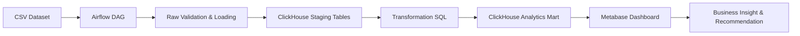

# 04 Architecture Plan

## 1. Architecture Objective

Arsitektur ini dirancang untuk membangun pipeline analitik _end-to-end_ yang mentransformasi dataset CSV mentah menjadi wawasan bisnis yang terstruktur. Fokus utama adalah menyediakan infrastruktur data yang _reproducible_ dan efisien untuk mendukung analisis _Customer Experience Analyst_ dalam menjawab penyebab stagnasi _review score_.

Arsitektur ini mengedepankan:

- **Reproducibility**: Seluruh proses dari loading hingga visualisasi dapat dijalankan ulang dengan hasil yang konsisten.
- **Demo-Ready**: Konfigurasi berbasis Docker memudahkan deploy saat presentasi atau demo.
- **Structured Data Layering**: Pemisahan yang jelas antara _raw data_, _staging tables_, dan _analytics mart_.
- **Performance**: Penggunaan ClickHouse sebagai basis data OLAP menjamin responsivitas dashboard Metabase.
- **Simplicity**: Desain dibuat optimal untuk diselesaikan dalam batas waktu project tanpa mengorbankan kualitas analitik.

## 2. High-Level Architecture

Berikut adalah alur data dalam arsitektur project ini:



**Penjelasan Layer:**

- **CSV Dataset**: Sumber data mentah lokal di folder `data/raw/`.
- **Airflow**: Orchestrator yang mengatur jadwal dan urutan pengerjaan task.
- **ClickHouse Staging**: Tabel di ClickHouse yang menyimpan data mentah dengan struktur yang menyerupai file CSV asli.
- **ClickHouse Analytics Mart**: Tabel agregat dan terdenormalisasi yang siap digunakan untuk _query_ dashboard.
- **Metabase**: Alat visualisasi untuk menyajikan data dalam bentuk grafik dan KPI.
- **Business Recommendation**: Hasil akhir berupa tindakan nyata bagi manajemen berdasarkan data dashboard.

## 3. Repository Architecture

Struktur folder project dirancang untuk memisahkan logika kode, dokumen, dan data:

```
farhan_fp_mci_customer_experience/
├── app/                  # Script aplikasi atau utility pendukung
├── dags/                 # Definisi pipeline Airflow (Python)
├── dashboard/            # Dokumentasi dan metadata Metabase
├── data/                 # Penyimpanan file data
│   ├── raw/              # File CSV asli (tidak untuk dipush)
│   ├── processed/        # Hasil export EDA awal
│   └── sample/           # Contoh data kecil untuk testing
├── docs/                 # Dokumentasi perancangan dan laporan
├── notebooks/            # Eksplorasi data (Jupyter)
├── paper/                # Draft publikasi/laporan formal
├── presentation/         # File presentasi final
├── sql/                  # Seluruh skrip basis data ClickHouse
│   ├── ddl/              # Skrip pembuatan tabel (CREATE)
│   ├── etl/              # Skrip transformasi data (INSERT/SELECT)
│   └── analytics/        # Query pendukung visualisasi
├── docker-compose.yml    # Konfigurasi container service
├── requirements.txt      # Dependensi Python
├── .gitignore            # File yang dikecualikan dari Git
└── README.md             # Panduan utama project
```

**Catatan Keamanan Data:**

- Folder `data/raw/` dan `data/processed/` tidak di-push ke GitHub untuk mencegah kebocoran data sensitif dan beban penyimpanan yang besar.
- File kode (`.py`), skrip SQL (`.sql`), dan dokumentasi (`.md`) tetap di-push untuk kolaborasi dan versi kontrol.

## 4. Data Source Layer

Daftar file CSV yang digunakan dalam pipeline:

| File CSV                   | Role      | Priority | Used For                                           |
| :------------------------- | :-------- | :------- | :------------------------------------------------- |
| `orders.csv`               | Core      | High     | Analisis status dan durasi pesanan.                |
| `order_reviews.csv`        | Core      | High     | Sumber utama skor kepuasan pelanggan.              |
| `order_items.csv`          | Core      | High     | Menghubungkan pesanan dengan produk dan penjual.   |
| `customers.csv`            | Dimension | High     | Informasi geografis pelanggan.                     |
| `sellers.csv`              | Dimension | High     | Informasi geografis penjual.                       |
| `products.csv`             | Dimension | High     | Informasi karakteristik produk.                    |
| `category_translation.csv` | Metadata  | High     | Translate nama kategori ke Bahasa Inggris.         |
| `order_payments.csv`       | Fact      | Medium   | Support analisis pengaruh metode bayar (opsional). |
| `geolocation.csv`          | Dimension | Low      | Pemetaan koordinat (tidak diprioritaskan di MVP).  |
| `mql.csv`                  | Marketing | Low      | Analisis funnel marketing (di luar scope CX).      |
| `closed_deals.csv`         | Marketing | Low      | Analisis funnel sales (di luar scope CX).          |

_Catatan: Analisis wilayah pada MVP akan menggunakan kolom state/city dari tabel customers dan sellers untuk efisiensi._

## 5. Airflow DAG Design

**DAG ID:** `dag_customer_experience_pipeline`

Pipeline ini bertugas memastikan data mengalir secara otomatis dari file mentah hingga menjadi mart yang siap saji.

| Task ID              | Task Name          | Description                                             | Output                     |
| :------------------- | :----------------- | :------------------------------------------------------ | :------------------------- |
| `start`              | Start              | Penanda awal eksekusi DAG.                              | -                          |
| `validate_raw_files` | Validate Raw       | Mengecek ketersediaan CSV wajib di `data/raw/`.         | Validasi sukses/gagal.     |
| `create_database`    | Create DB          | Membuat database `fp_mci_customer_experience`.          | Database tersedia.         |
| `create_staging`     | Create Staging     | Menyiapkan skema tabel staging di ClickHouse.           | Tabel staging kosong.      |
| `load_staging`       | Load CSV           | Memuat data dari CSV ke tabel staging.                  | Data mentah di ClickHouse. |
| `create_mart`        | Build Mart         | Menjalankan transformasi SQL untuk membangun mart.      | Analytics mart terisi.     |
| `run_dqc`            | Data Quality Check | Mengecek jumlah baris dan integritas data (null check). | Laporan kualitas data.     |
| `end`                | End                | Penanda akhir eksekusi DAG.                             | -                          |

**Dependency Flow:**
`start >> validate_raw_files >> create_database >> create_staging >> load_staging >> create_mart >> run_dqc >> end`

## 6. ClickHouse Database Design

Seluruh data akan dikelola dalam satu database utama:

- **Database Name**: `fp_mci_customer_experience`
- **Engine**: Secara umum menggunakan `MergeTree` family untuk performa analitik yang optimal.

## 7. Staging Table Design

Tabel staging bersifat _transient_ dengan transformasi minimal untuk mempertahankan integritas data asli.

| Staging Table            | Source CSV                 | Granularity        | Purpose                              |
| :----------------------- | :------------------------- | :----------------- | :----------------------------------- |
| `stg_orders`             | `orders.csv`               | 1 row per order    | Dasar analisis siklus hidup pesanan. |
| `stg_order_reviews`      | `order_reviews.csv`        | 1 row per review   | Dasar analisis sentimen/skor.        |
| `stg_order_items`        | `order_items.csv`          | 1 row per item     | Detail transaksi penjual & produk.   |
| `stg_customers`          | `customers.csv`            | 1 row per customer | Dimensi lokasi pelanggan.            |
| `stg_sellers`            | `sellers.csv`              | 1 row per seller   | Dimensi lokasi & ID penjual.         |
| `stg_products`           | `products.csv`             | 1 row per product  | Dimensi kategori produk.             |
| `stg_category_translate` | `category_translation.csv` | 1 row per category | Pemetaan nama kategori produk.       |

## 8. Draft Staging Schema (High-Level)

### `stg_orders`

| Column                          | Suggested Type     | Notes                          |
| :------------------------------ | :----------------- | :----------------------------- |
| `order_id`                      | String             | PK                             |
| `customer_id`                   | String             | FK to customers                |
| `order_status`                  | String             | Status pesanan                 |
| `order_purchase_timestamp`      | Nullable(DateTime) | Waktu pembelian                |
| `order_delivered_customer_date` | Nullable(DateTime) | Waktu sampai di tangan pembeli |
| `order_estimated_delivery_date` | Nullable(DateTime) | Estimasi waktu sampai          |

### `stg_order_reviews`

| Column                 | Suggested Type | Notes                 |
| :--------------------- | :------------- | :-------------------- |
| `review_id`            | String         | ID review             |
| `order_id`             | String         | FK to orders          |
| `review_score`         | Int8           | Skor 1-5              |
| `review_creation_date` | DateTime       | Tanggal review dibuat |

_Draft skema untuk tabel lain (items, customers, sellers, products) akan mengikuti format standar String, Int32, dan Nullable(DateTime) sesuai isi file CSV._

## 9. Analytics Mart Design

Tabel mart dirancang untuk performa dashboard tinggi (terdenormalisasi).

| Mart Table             | Granularity             | Purpose                                     | Used By Dashboard                 |
| :--------------------- | :---------------------- | :------------------------------------------ | :-------------------------------- |
| `mart_cx_orders`       | 1 row per order         | Tren review, status pengiriman, & geografi. | KPI, Line Chart, Map.             |
| `mart_cx_items`        | 1 row per order item    | Analisis per seller dan kategori produk.    | Table ranking, Category analysis. |
| `mart_monthly_kpi`     | 1 row per month         | Agregat bulanan untuk tren cepat.           | Executive Overview.               |
| `mart_delivery_impact` | 1 row per status/bucket | Analisis korelasi keterlambatan vs skor.    | Delivery impact section.          |

## 10. Core Mart Columns

### `mart_cx_orders`

- **Keys**: `order_id`, `customer_id`.
- **Review**: `review_score`, `review_month`, `is_low_rating_2` (threshold skor ≤ 2).
- **Logistics**: `delivery_days`, `delay_days`, `delivery_status` (late/on-time), `delay_bucket`.
- **Region**: `customer_city`, `customer_state`.

### `mart_cx_items`

- **Includes all `mart_cx_orders` keys** plus:
- **Product**: `product_id`, `product_category_name_english`.
- **Seller**: `seller_id`, `seller_city`, `seller_state`.
- **Finance**: `price`, `freight_value`.

## 11. Feature Engineering Rules

| Feature           | Definition / Formula                                                                     |
| :---------------- | :--------------------------------------------------------------------------------------- |
| `delivery_days`   | Selisih hari antara `order_purchase_timestamp` dan `order_delivered_customer_date`.      |
| `delay_days`      | Selisih hari antara `order_estimated_delivery_date` dan `order_delivered_customer_date`. |
| `delivery_status` | 'late' jika `delay_days > 0`, 'on_time_or_early' jika sebaliknya.                        |
| `delay_bucket`    | Pengelompokan: early, late 1-3d, 4-7d, 8-14d, 15d+, unknown.                             |
| `is_low_rating_2` | 1 jika `review_score <= 2`, 0 jika sebaliknya.                                           |
| `review_month`    | Format YYYY-MM dari `review_creation_date`.                                              |

_Penting: Untuk tabel `mart_cx_orders`, hanya ulasan terbaru per pesanan yang digunakan (de-duplikasi)._

## 12. SQL Analytics Plan

File SQL akan diatur secara berurutan:

- `sql/ddl/`: Pembuatan database, staging, dan mart.
- `sql/etl/`: Proses perpindahan data dari staging ke mart.
- `sql/analytics/`: Query agregat untuk mendukung visualisasi Metabase.

## 13. Dashboard Query Mapping

Penyajian di Metabase akan menggunakan dataset dari **Analytics Mart Layer**.

- **KPI Cards**: Diambil dari `mart_monthly_kpi`.
- **Trend Charts**: Diambil dari `mart_monthly_kpi` dan `mart_cx_orders`.
- **Problematic Segments**: Diambil dari `mart_cx_items` (filtering min. order volume).
- **Priority Table**: Hasil join agregasi seller/kategori dengan metrik _late rate_ dan _low rating rate_.

## 14. Metabase Integration Plan

- Metabase akan dikonfigurasi untuk terhubung langsung ke port ClickHouse.
- Penggunaan **Dashboard Filters** (Time, State, Category, Delivery Status) akan diimplementasikan sebagai parameter variable di SQL Metabase.
- Visualisasi tabel ranking akan menggunakan limitasi (Top N) untuk menjaga kejelasan.

## 15. Day 2 Implementation Plan

1. **Infrastructure**: Setup `docker-compose.yml` (Airflow, ClickHouse, Metabase).
2. **Schema**: Eksekusi DDL staging dan mart di ClickHouse.
3. **ETL Development**: Pembuatan script pemuatan data (Python/SQL).
4. **Pipeline**: Pembuatan dan pengujian DAG Airflow secara utuh (_end-to-end_).
5. **Validation**: Cek konsistensi jumlah baris antara CSV dan Staging.
6. **Dashboarding**: Membangun visualisasi di Metabase berbasis Mart yang telah terisi.

## 16. Design Trade-off

- **Separated Marts**: Memisahkan staging dan mart menambah kompleksitas tetapi menjamin _query_ dashboard yang jauh lebih cepat bagi user non-teknis.
- **No Geolocation**: Koordinat lintang/bujur dilewatkan agar pipeline lebih ringan; analisis regional cukup menggunakan nama negara bagian.
- **Rule-based Feature**: Fokus pada fitur berbasis aturan (SLA delivery) daripada model ML agar temuan lebih mudah dijelaskan kepada pimpinan perusahaan.

## 17. Success Criteria

- **DAG Status**: Pipeline Airflow berjalan sukses tanpa kegagalan task.
- **Data Integrity**: Jumlah baris di staging table cocok dengan file CSV asli.
- **Performance**: Query dashboard Metabase merespon dalam waktu < 2 detik.
- **Business Goal**: Dashboard berhasil menunjukkan segmen yang menjadi penyebab utama rating rendah.
- **Reproducibility**: Project dapat dipindahkan ke mesin lain hanya dengan menjalankan satu perintah docker-compose.
