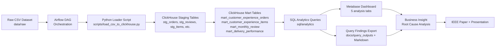
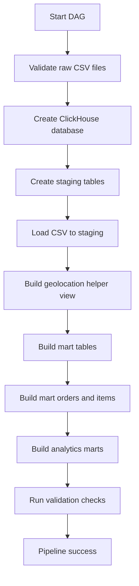
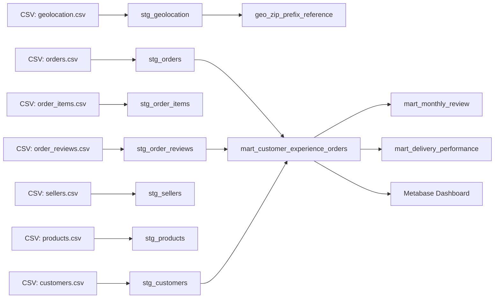
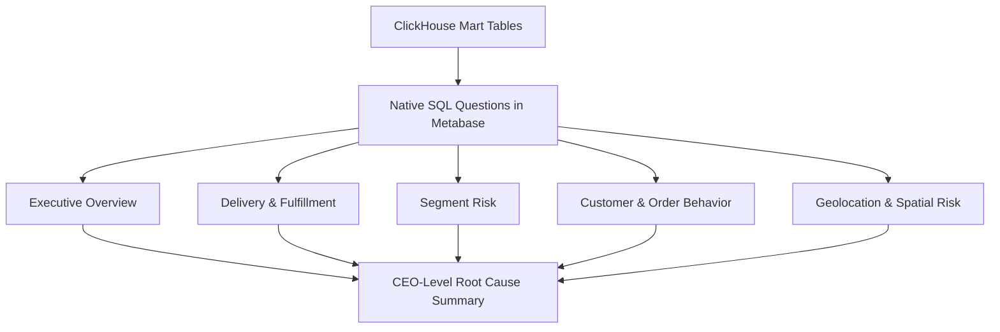
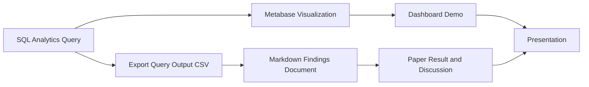

# Repository Architecture and Flow Guide - FP MCI Customer Experience

## 1. Project Overview

Project FP MCI 2026 Customer Experience Root Cause Analysis berfokus pada analisis pengalaman pelanggan pada transaksi e-commerce. Persona utama project ini adalah **Customer Experience Analyst** yang bertugas membaca pola review, keterlambatan delivery, risiko seller, risiko kategori produk, perilaku order, serta indikasi spasial/geolocation.

Masalah bisnis utama adalah review score yang sulit meningkat atau terlihat stagnan. Project ini tidak hanya menampilkan angka dashboard, tetapi juga menyiapkan alur data yang dapat ditelusuri dari dataset mentah, pipeline, analytical warehouse, SQL analytics, sampai evidence log untuk paper dan presentasi.

Output utama project:

- Data pipeline berbasis Airflow.
- Analytical warehouse berbasis ClickHouse.
- Dashboard Metabase dengan 5 tab analisis.
- Query findings dalam Markdown dan CSV untuk bahan paper.
- Struktur repository GitHub yang dapat direproduksi.
- Bahan untuk paper format IEEE dan PPT presentasi.

## 2. Repository Structure

Struktur berikut disusun berdasarkan kondisi aktual repository saat dokumen ini dibuat.

```text
.
|-- app/
|-- dags/
|   `-- dag_customer_experience_pipeline.py
|-- dashboard/
|   |-- README.md
|   `-- screnshoot/
|-- data/
|   `-- raw/
|-- docs/
|   |-- assets/
|   |-- query_outputs/
|   |-- 05_data_quality_report.md
|   |-- 06_literature_scoping.md
|   |-- 07_eda_customer_experience_summary.md
|   |-- 08_business_analysis_summary.md
|   |-- 09_metabase_query_mapping.md
|   |-- 12_dashboard_query_findings.md
|   `-- 13_repository_architecture_guide.md
|-- models/
|-- notebooks/
|   |-- 01_data_understanding.ipynb
|   |-- 02_eda_customer_experience.ipynb
|   `-- 03_ml_low_rating_prediction.ipynb
|-- paper/
|-- scripts/
|   |-- export_dashboard_findings.py
|   `-- load_csv_to_clickhouse.py
|-- sql/
|   |-- analytics/
|   |-- ddl/
|   `-- etl/
|-- .env.example
|-- .gitignore
|-- docker-compose.yml
|-- Dockerfile.airflow
|-- README.md
`-- requirements.txt
```

Fungsi folder utama:

- `data/raw/`: tempat dataset mentah CSV, misalnya `orders.csv`, `order_reviews.csv`, `order_items.csv`, `customers.csv`, `sellers.csv`, `products.csv`, `order_payments.csv`, `category_translation.csv`, dan `geolocation.csv`.
- `docs/`: dokumentasi analisis, mapping dashboard, architecture notes, query findings, dan bahan penjelasan paper.
- `docs/assets/`: asset gambar atau plot pendukung dokumentasi dan paper. Pada kondisi saat ini folder ini tersedia sebagai area asset, bukan komponen utama pipeline.
- `docs/query_outputs/`: output CSV hasil ekspor query dashboard dari `scripts/export_dashboard_findings.py`.
- `notebooks/`: eksplorasi data dan analisis awal. Notebook ML yang ada diperlakukan sebagai baseline/legacy optional, bukan bagian utama arsitektur final.
- `paper/`: folder untuk referensi dan bahan paper IEEE.
- `scripts/`: script operasional, terutama loader CSV ke ClickHouse dan exporter hasil query dashboard.
- `sql/`: definisi DDL, ETL mart, helper view, dan analytics SQL untuk Metabase/paper.
- `models/`: tempat artefak model jika digunakan. Dalam arsitektur final saat ini, advanced ML/NLP belum menjadi core pipeline.
- `dashboard/`: dokumentasi dashboard Metabase dan screenshot.
- `dags/`: DAG Airflow yang mengorkestrasi pipeline.
- Root files:
  - `docker-compose.yml`: konfigurasi container ClickHouse, Postgres, Airflow, dan Metabase.
  - `Dockerfile.airflow`: image Airflow custom untuk dependency Python pipeline.
  - `.env.example`: template konfigurasi environment.
  - `.gitignore`: aturan file yang tidak masuk Git.
  - `requirements.txt`: dependency Python umum untuk environment lokal.
  - `README.md`: landing documentation repository.

## 3. Main System Architecture

Arsitektur utama project dimulai dari raw CSV dataset. Airflow menjalankan validasi file, membuat database/tabel ClickHouse, memuat CSV ke staging table, membangun mart table, dan menjalankan validasi output. ClickHouse menjadi analytical warehouse untuk staging, mart, helper view, dan query analytics. Metabase membaca ClickHouse menggunakan native SQL untuk dashboard interaktif. Hasil query juga diekspor ke Markdown dan CSV agar insight dapat digunakan dalam paper dan presentasi.



## 4. Airflow DAG Architecture

Airflow berperan sebagai orchestrator pipeline. DAG tidak hanya menjalankan script, tetapi memastikan urutan pipeline berjalan konsisten: validasi input, pembuatan schema, loading data, pembuatan helper view, pembangunan mart, dan validasi output.

Urutan task aktual pada DAG:

1. `validate_raw_files`
2. `create_clickhouse_database`
3. `create_staging_tables`
4. `load_csv_to_staging`
5. `build_geo_zip_prefix_reference`
6. `create_mart_tables`
7. `build_customer_experience_orders`
8. `build_customer_experience_items`
9. `build_monthly_review_trend`
10. `build_delivery_performance`
11. `validate_pipeline_outputs`



Panduan manual flowchart:

- Start/End menggunakan terminator.
- Validasi file menggunakan process box.
- Kondisi file hilang menggunakan decision/diamond.
- Load CSV menggunakan process box.
- Staging dan mart ClickHouse menggunakan database cylinder.
- Metabase dashboard menggunakan display/report shape.
- Paper dan PPT menggunakan document/display shape.

## 5. ClickHouse Data Layer

ClickHouse dibagi menjadi tiga lapisan:

1. **Staging layer**: representasi data mentah dari CSV.
2. **Mart layer**: tabel analitik siap dashboard.
3. **Analytics query layer**: query read-only untuk Metabase dan dokumentasi.



Tabel utama:

- `stg_orders`: staging order dan timestamp fulfilment.
- `stg_order_reviews`: staging review score dan timestamp review.
- `stg_order_items`: staging item, seller, price, freight.
- `stg_customers`: staging customer, city, state, dan zip prefix.
- `stg_sellers`: staging seller, city, state, dan zip prefix.
- `stg_products`: staging product dan kategori.
- `stg_order_payments`: staging metode dan nilai pembayaran.
- `stg_category_translation`: mapping kategori Portugis ke English.
- `stg_geolocation`: staging latitude/longitude per zip prefix.
- `geo_zip_prefix_reference`: helper view satu baris per zip prefix agar join geolocation tidak menduplikasi order.
- `mart_customer_experience_orders`: mart order-level untuk review, delivery, delay, dan customer region.
- `mart_customer_experience_items`: mart item-level untuk seller, category, dan item dimension.
- `mart_monthly_review`: mart agregat bulanan review.
- `mart_delivery_performance`: mart delivery status dan delay bucket.

## 6. Metabase Dashboard Architecture

Dashboard Metabase terdiri dari 5 tab:

1. **Executive Overview**
   - KPI average review score.
   - Low rating rate.
   - Late order rate.
   - Monthly review trend.
   - Review distribution.
   - Priority CX segments.

2. **Delivery & Fulfillment Deep Dive**
   - Delivery status impact.
   - Delay bucket impact.
   - Monthly late rate vs low rating.
   - Non-delivered order.
   - Delivery phase breakdown.
   - Processing/transit bucket.

3. **Segment Risk: Seller, Category, Region**
   - Risk seller.
   - Risk category.
   - Customer region risk.
   - Seller region risk.
   - Priority segment table.

4. **Customer & Order Behavior**
   - Retention funnel.
   - Multi-seller order effect.
   - Item count effect.
   - Order value bucket.
   - Installment vs review.
   - Review timing.

5. **Geolocation & Spatial Risk**
   - Customer state hotspot map.
   - Problem routes.
   - Distance bucket vs late/low rating.
   - ETA deviation by state.
   - ZIP prefix risk.



## 7. Analysis Evidence Flow

Dashboard bukan satu-satunya bukti analisis. Query analytics juga diekspor ke CSV dan Markdown agar hasilnya dapat dikutip dalam Bab Hasil dan Pembahasan paper. Dengan cara ini, insight tidak hanya bergantung pada tampilan Metabase, tetapi juga memiliki evidence log yang reproducible.



## 8. Flowchart Drawing Guide

| Komponen           | Bentuk Flowchart  | Label yang Disarankan        | Anak Panah ke           |
| ------------------ | ----------------- | ---------------------------- | ----------------------- |
| Raw CSV            | Document/Data     | Raw CSV Dataset              | Airflow DAG             |
| Airflow DAG        | Process           | Airflow Orchestration        | Python Loader           |
| Missing file check | Decision/Diamond  | Are all CSV files available? | Continue / Stop         |
| Python loader      | Process           | Load CSV to ClickHouse       | Staging Tables          |
| ClickHouse staging | Database cylinder | Staging Tables               | Mart Tables             |
| ClickHouse mart    | Database cylinder | Analytical Mart Tables       | Metabase / Query Export |
| SQL analytics      | Process           | SQL Analytics Queries        | Dashboard Cards         |
| Metabase           | Display/Report    | Metabase Dashboard           | Business Insight        |
| Query findings MD  | Document          | Dashboard Query Findings     | Paper                   |
| Paper              | Document          | IEEE Paper                   | Presentation            |
| PPT                | Document/Display  | Final Presentation           | Demo                    |

Contoh narasi alur:

Dataset CSV mentah disimpan pada folder `data/raw`. Airflow menjalankan pipeline untuk memvalidasi dan memuat data ke ClickHouse. Data pertama masuk ke staging table, lalu ditransformasikan menjadi mart table yang siap dianalisis. Metabase menggunakan native SQL query dari mart table untuk membuat dashboard. Hasil query juga diekspor ke Markdown agar insight dapat digunakan dalam paper dan presentasi.

## 9. Current Repository Status

### Completed

- Docker Compose untuk ClickHouse, Postgres, Airflow, dan Metabase.
- `Dockerfile.airflow` untuk dependency Airflow build-time.
- DAG Airflow untuk validasi raw CSV, load staging, helper geolocation, mart build, dan validation checks.
- DDL staging, DDL mart, ETL mart orders/items, dan helper view geolocation.
- SQL analytics `01` sampai `32`.
- Metabase dashboard dengan 5 tab analisis.
- Export query findings ke `docs/12_dashboard_query_findings.md` dan `docs/query_outputs/`.
- Dokumentasi dashboard dan mapping query.

### In progress

- Penyusunan README final yang merangkum pipeline, dashboard, dan cara menjalankan project.
- Penyusunan narasi paper IEEE dan PPT presentasi berdasarkan dashboard findings.
- Penyesuaian final screenshot atau visual Metabase sesuai kebutuhan demo.

### Planned

- Advanced ML/NLP sebagai future work. Notebook ML baseline yang masih ada diperlakukan sebagai optional/legacy dan bukan core pipeline final.
- Pengembangan analisis geolocation lanjutan jika diperlukan, misalnya distance optimization atau spatial clustering.
- Migrasi metadata Metabase dari H2 ke Postgres jika dashboard perlu dikelola jangka panjang.

## 10. How to Reproduce the Pipeline

Langkah umum menjalankan project:

1. Clone repository.
2. Salin `.env.example` menjadi `.env`, lalu sesuaikan konfigurasi non-sensitif sesuai environment lokal.
3. Pastikan dataset CSV tersedia di `data/raw/`.
4. Jalankan Docker Compose:

   ```bash
   docker compose build airflow
   docker compose up -d
   ```

5. Pastikan service ClickHouse, Airflow, dan Metabase aktif.
6. Buka Airflow pada port yang dikonfigurasi di `docker-compose.yml`.
7. Jalankan DAG `dag_customer_experience_pipeline`.
8. Buka Metabase pada port yang dikonfigurasi di `docker-compose.yml`.
9. Akses dashboard Customer Experience Root Cause Dashboard.
10. Jika perlu evidence log untuk paper, jalankan:

    ```bash
    python scripts/export_dashboard_findings.py
    ```

11. Baca hasilnya di:

    ```text
    docs/12_dashboard_query_findings.md
    docs/query_outputs/
    ```

Catatan keamanan: jangan menaruh credential sensitif di dokumentasi. Gunakan `.env.example` sebagai referensi konfigurasi.

## 11. Suggested README Structure

Outline README final yang disarankan:

- Project title.
- Business problem.
- Tech stack.
- Architecture.
- Repository structure.
- How to run.
- Dashboard overview.
- Key findings.
- Paper and presentation.
- Future work: advanced ML/NLP.

## 12. Mermaid Diagram Collection

### Main System Architecture


### Airflow DAG Architecture


### ClickHouse Data Layer


### Metabase Dashboard Architecture


### Analysis Evidence Flow


